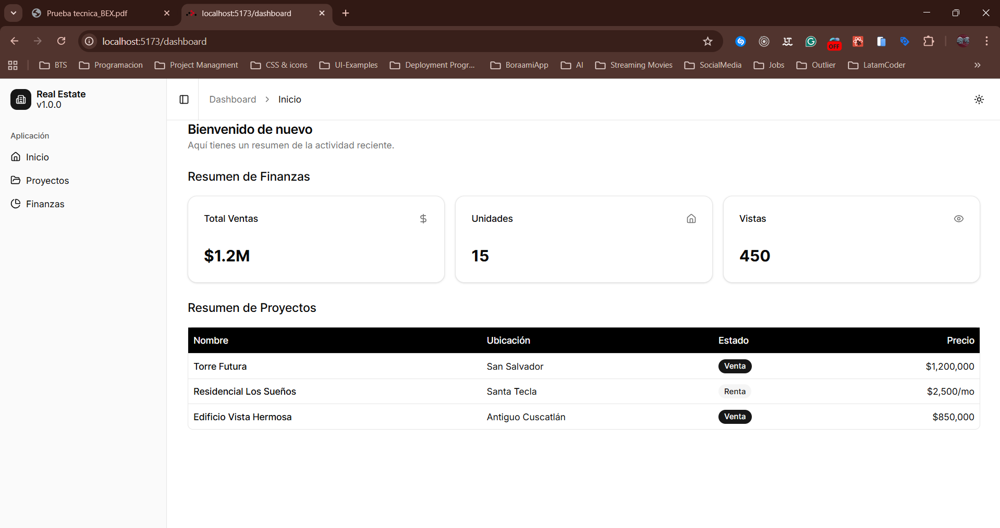

# Real Estate Dashboard

Aplicación de dashboard inmobiliario minimalista construida con React Router v7, Tailwind CSS v4, y Shadcn/ui.

## Características

- **Diseño Minimalista**: UI limpia y moderna sin gradientes, utilizando una paleta neutra.
- **Navegación Intuitiva**: Sidebar expandible/colapsable con iconos.
- **Gestión de Proyectos**: Tabla de proyectos inmobiliarios con estado y precios.
- **Finanzas**: Cards de métricas financieras clave.
- **Routing Moderno**: Utilizando React Router v7 con configuración basada en archivos/rutas.

## Arquitectura

### Stack Tecnológico

| Componente | Tecnología | Descripción |
| :--- | :--- | :--- |
| **Framework** | React Router v7 | Framework principal para renderizado y enrutamiento (SPA/Hybrid). |
| **Estilos** | Tailwind CSS v4 | Motor de estilos utilitario para diseño rápido y responsive. |
| **UI Kit** | Shadcn/ui | Colección de componentes reutilizables basados en Radix UI. |
| **Iconos** | Lucide React | Biblioteca de iconos vectoriales moderna y ligera. |
| **Lenguaje** | TypeScript | Superset tipado de JavaScript para mayor robustez. |

### Estructura de Directorios

- `app/routes`: Definición de rutas y páginas.
- `app/components`: Componentes reutilizables.
- `app/components/ui`: Componentes de Shadcn.
- `app/routes.ts`: Configuración de rutas.

## Instrucciones de Instalación

1.  **Clonar el repositorio** (o navegar a la carpeta del proyecto):
    ```bash
    cd bex-tech-challenge
    ```

2.  **Instalar dependencias**:
    ```bash
    npm install
    ```

3.  **Iniciar servidor de desarrollo**:
    ```bash
    npm run dev
    ```

4.  **Construir para producción**:
    ```bash
    npm run build
    ```

## Rutas Principales

- `/dashboard`: Vista principal (Resumen con enlaces).
- `/dashboard/proyectos`: Tabla de proyectos inmobiliarios.
- `/dashboard/finanzas`: Métricas y KPIs financieros.

## Vista Previa




